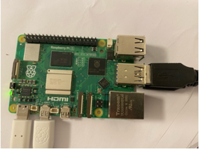

# Lightweight Online Imputation of Sensor Data Streams via Temporal Feature Propagation


This is the repository of TFP project which consists of harware configuration, code, datasets and instructions for reproducibility.


# Implementation Details 

### Hardware Setup
To reproduce the experimental results, the programs are expected to run in a Raspberry Pi 5 device [intro](https://raspberrypi.dk/produkt/raspberry-pi-5-8-gb/?gad_source=1&gclid=Cj0KCQiA4rK8BhD7ARIsAFe5LXJdB70zu1eyl5-ELIoaENuvOB_VjjpfsETx1gnH2uW6pQwv8PD3wygaAsuhEALw_wcB). Regarding how to set up the device, please see [here](https://www.raspberrypi.com/documentation/computers/getting-started.html).



### Python Libraries Setup
- Pytorch 1.8.1
- Numpy 1.19.2
- Pandas 1.1.3
- Sklearn 0.24.1
- pypots
- torch_geometric
- confluent-kafka 2.2.0
- codecarbon 2.3.4

To install the above libraries in the Raspberry Pi 5, it is suggested to use a python virtual environment because otherwise one may encounter incompatibility issues due to different hardware environment than windows-based or linux-based systems.  Afterwards, you may use " pip install xxx " to install each of the above python libraries.

### Usage

***Create a sensor data stream***

*Create a Confluent Kafka cluster*

login in Confluent cloud to create a Kafka cluster [there](https://confluent.cloud/environments/env-z6v8vy/clusters). This will generate a "client.properties" file that will be used by both producer and consumer.

``` 
# Required connection configs for Kafka producer, consumer, and admin
bootstrap.servers=pkc-921jm.us-east-2.aws.confluent.cloud:9092
security.protocol=SASL_SSL
sasl.mechanisms=PLAIN
sasl.username=4HKWXN3Y6XHBN6KO
sasl.password=hnxsekt4T0hSyjY0TL3xo7HuLNUtsvxsyH9BGVS+dzZWR3tEX9dMwQEt56ZpVXIF

# Best practice for higher availability in librdkafka clients prior to 1.7
session.timeout.ms=45000
client.id=ccloud-python-client-7d85d1d4-cd41-4541-a69b-0e9ad6b71945
```

*Start a Kafka producer to produce a Kafka stream*

find a PC and run the following command.
``` 
cd kafka; 
python3 generate_stream.py --dataset Motion --miss_ratio 0.5 # produce a sensor data stream with specified sparsity levels 

```

***Impute a sensor data stream***: 

*wTFP/wTFPd*

``` 
python3 imputeStream_wTFP.py --p 10 --tau 5; 
``` 

*baselines*

``` 
cd baseline;
python3 imputeStream_CD.py --p 10; #CD
python3 imputeStream_mpin.py --p 10; #mpin
python3 imputeStream_MICE.py --p 10; #MICE
python3 imputeStream_MF.py --p 10; #MF
....

``` 
The performance results are stored in the default folder: ./exp_results/. For method-specific parameters (e.g., K value for KNN), they are already tuned properly. 
However, they can be changed as well from the script entrance if needs arise.


### Explaination of Parameters

- dataset: sensor data stream dataset, e.g., Motion, Water, and Gas
- miss_ratio: the sparsity level of sensor data stream, e.g., 0.9
- tau: retrospect length
- p: the number of incremental/new instances


### Acknowledgements

We appreciate the work of SAITS, and their contributed codes available in [here](https://github.com/WenjieDu/SAITS). We are also grateful for the repository 
[here](https://github.com/XLI-2020/time-series-kafka-demo) to facilitate the creation of sensor data streams using Kafka.


